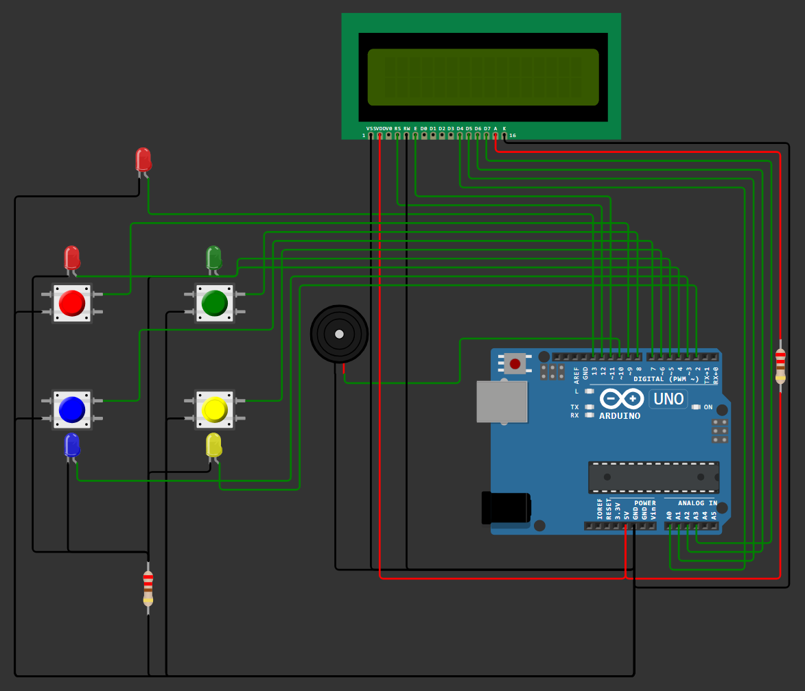

### Simon Says - Arduino Hafıza Oyunu

Bu proje, Arduino UNO R3 kullanılarak geliştirilen klasik SIMON SAYS hafıza oyunudur.
Oyunun amacı, kullanıcıya gösterilen LED dizisini doğru sırayla tekrar etmektir.

## Kullanılan Donanım ve Özellikler

* 4 LED - Renkli LED'ler ile desen gösterimi
* 1 LED - Game-Over Dönüşü için
* 4 Button - Oyunucunun girişleri için
* 16x2 LCD Ekran - Güncel skor ve yüksek skor bilgisi gösterimi
* Dahili EEPROM - En yüksek skorun kalıcı olarak saklanması
* Buzzer - Doğru ve yanlış girişlerde sesli geri bildirim
* Arduino UNO R3

## Yazılım
* EEPROM kullanılarak oyun kapansa bile en yüksek skor saklanır.
* LCD'de oyun sırasında hem anlık skor hem de yüksek skor gösterilir.
* Algoritma ve kodlar tarafımdan geliştirilmiştir.

## Simülayson
Bu proje, WOKWI simülasyon platformu üzerinde tasarlanmış ve test edilmiştir.

## Görseller

# Devre Şeması

# Oyun İçi Görüntü 1

# Oyun İçin Görüntü 2

